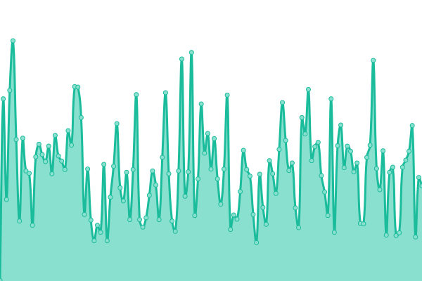

# [📈 Live Status](https://uptime.lirtual.cloudns.org): <!--live status--> **🟩 All systems operational**

This repository contains the open-source uptime monitor and status page for [autoactions](https://uptime.lirtual.cloudns.org), powered by [Upptime](https://github.com/upptime/upptime).

With [Upptime](https://upptime.js.org), you can get your own unlimited and free uptime monitor and status page, powered entirely by a GitHub repository. We use [Issues](https://github.com/autoactions/upptime/issues) as incident reports, [Actions](https://github.com/autoactions/upptime/actions) as uptime monitors, and [Pages](https://uptime.lirtual.cloudns.org) for the status page.

<!--start: status pages-->
<!-- This summary is generated by Upptime (https://github.com/upptime/upptime) -->
<!-- Do not edit this manually, your changes will be overwritten -->
<!-- prettier-ignore -->
| URL | Status | History | Response Time | Uptime |
| --- | ------ | ------- | ------------- | ------ |
|  [Openai API](https://openai.aigateway.lirtual.cloudns.org/) | 🟩 Up | [openai-api.yml](https://github.com/autoactions/upptime/commits/HEAD/history/openai-api.yml) | 

 262ms
     
 | 

<a href="https://uptime.lirtual.cloudns.org/history/openai-api">8.39%</a>
    

|  [LobeChat](https://lobe.lirtual.cloudns.org/) | 🟩 Up | [lobe-chat.yml](https://github.com/autoactions/upptime/commits/HEAD/history/lobe-chat.yml) | 

 1672ms
     
 | 

<a href="https://uptime.lirtual.cloudns.org/history/lobe-chat">100.00%</a>
    

|  [RSSHub](https://rsshub.lirtual.cloudns.org/) | 🟩 Up | [rss-hub.yml](https://github.com/autoactions/upptime/commits/HEAD/history/rss-hub.yml) | 

 862ms
     
 | 

<a href="https://uptime.lirtual.cloudns.org/history/rss-hub">22.72%</a>
    

|  [Telegraph Image](https://img.lirtual.cloudns.org/) | 🟩 Up | [telegraph-image.yml](https://github.com/autoactions/upptime/commits/HEAD/history/telegraph-image.yml) | 

 277ms
     
 | 

<a href="https://uptime.lirtual.cloudns.org/history/telegraph-image">22.72%</a>
    

|  [FlareDrive](https://flaredrive.lirtual.cloudns.org/) | 🟩 Up | [flare-drive.yml](https://github.com/autoactions/upptime/commits/HEAD/history/flare-drive.yml) | 

 254ms
     
 | 

<a href="https://uptime.lirtual.cloudns.org/history/flare-drive">22.72%</a>
    

<!--end: status pages-->

[**Visit our status website →**](https://uptime.lirtual.cloudns.org)

## 📄 License

- Powered by: [Upptime](https://github.com/upptime/upptime)
- Code: [MIT](./LICENSE) © [Anand Chowdhary](https://anandchowdhary.com), supported by [Pabio](https://pabio.com)
- Data in the `./history` directory: [Open Database License](https://opendatacommons.org/licenses/odbl/1-0/)
